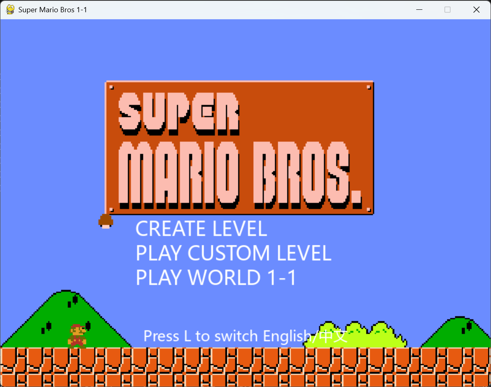
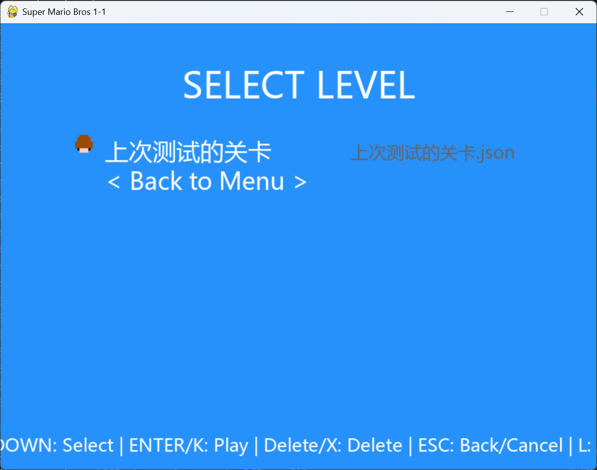
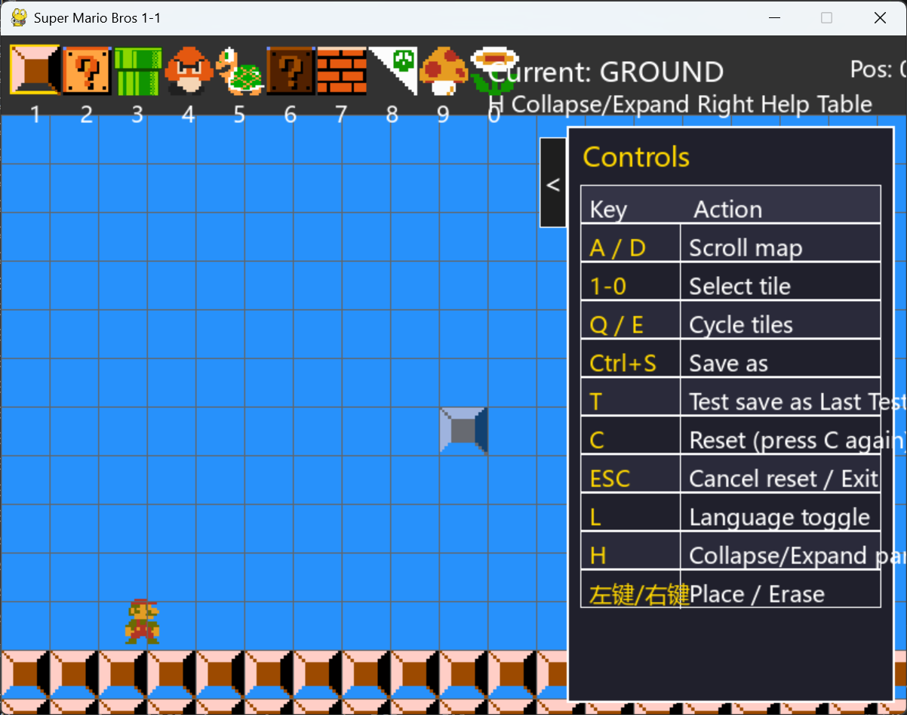

# Super Mario Creater for PC

A Mario project built by https://github.com/TobyfoxpurePython/-python, supporting two main play modes.

## How to Run

1. Install Python 3.10+
2. Install dependencies

	pip install pygame-ce

3. Launch the game

	python mario_open.py

## In-Game Controls

### Mario Basic Controls

| Action | Key |
|---|---|
| Move Left | A |
| Move Right | D |
| Jump | K |
| Sprint / Action | J |
| Crouch | S |
| Exit current custom level | ESC |

### General UI Controls

| Action | Key |
|---|---|
| Confirm (menu) | Enter / K |
| Move selection up/down | Arrow Up / Down or W / S |
| Switch language (ZH/EN) | L |

### Custom Level Select Screen

| Action | Key |
|---|---|
| Select level up/down | Arrow Up / Down or W / S |
| Play selected level | Enter / K |
| Delete selected level (double confirm) | Delete or X |
| Cancel delete / Back | ESC |

## Level Editor Controls

### Map and Tile Editing

| Action | Key |
|---|---|
| Scroll map left/right | A / D or Arrow Left / Right |
| Select tile slot | 1~9, 0 |
| Cycle tiles | Q / E |
| Place tile | Left Mouse Button |
| Erase tile | Right Mouse Button |

### Editor Functions

| Action | Key |
|---|---|
| Save (custom name) | Ctrl + S |
| Test level (auto-save as "Last Tested Level") | T |
| Reset map (press twice to confirm) | C |
| Cancel reset / Exit editor | ESC |
| Switch language (ZH/EN) | L |
| Collapse/Expand right help panel | H |

### Editor Save Rules

- The level must contain a flagpole before it can be saved.
- The file extension `.json` is added automatically by the program.
- All custom levels are saved in the `custom_levels` directory.

## Level Editor Tile List

| Slot | Tile |
|---|---|
| 1 | Ground |
| 2 | Upgrade Question Box |
| 3 | Pipe |
| 4 | Goomba |
| 5 | Koopa |
| 6 | Coin Question Box |
| 7 | Brick |
| 8 | Flagpole |
| 9 | Mushroom |
| 0 | Fire Flower |

## Project Structure

- mario_open.py: Program entry point
- data/states/level_editor.py: Level editor
- data/states/level_select.py: Custom level select screen
- data/states/custom_level.py: Custom level runtime state
- custom_levels/: User-created level files

## Contributions

Issues and Pull Requests are welcome.
